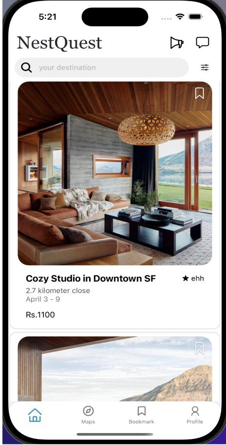
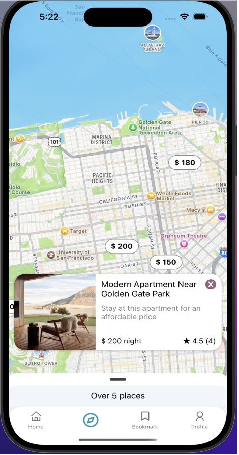
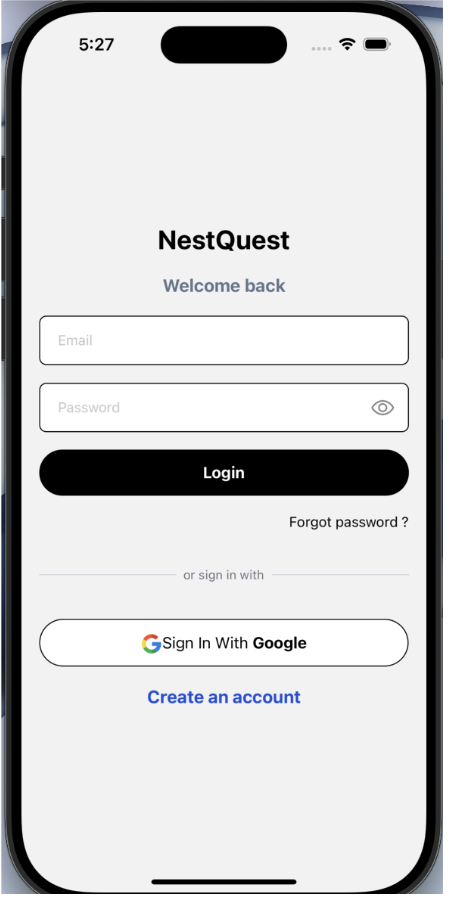
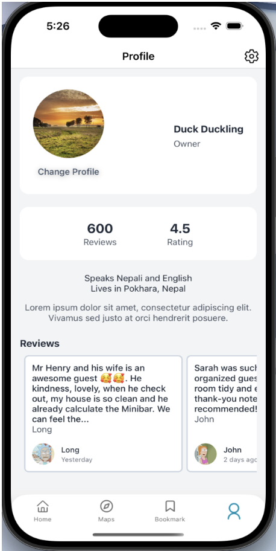

# 🏠 NestQuest - Room Rental Platform

NestQuest is a modern room rental web application designed to simplify the process of finding, listing, and managing rental spaces. It connects tenants and property owners through an intuitive and efficient platform.

---

## 🚀 Features

### 🔍 For Users (Tenants)

- Browse available rooms and properties
- Search & filter by location, price, and amenities
- View detailed room descriptions
- Contact property owners

### 🏡 For Owners

- List rooms with images and descriptions
- Manage listings easily
- Update availability and pricing

### 🔐 Authentication

- Secure login and registration
- Token-based authentication

### 💬 Additional Features

- Real-time updates (if implemented)
- Responsive design for mobile and desktop

---

## 🛠️ Tech Stack

### Frontend

- React / React Native (Expo)
- Tailwind CSS

### Backend

- Django
- Django Rest Framework (DRF)

### Database

- PostgreSQL

### Other Tools

- Axios
- JWT Authentication

---

## 📸 Demo Screenshots

<table width="100%">
  <tr>
    <td align="center" width="50%">
      
      <br>
      <b>🏠 Home Page</b>
    </td>
    <td align="center" width="50%">
      
      <br>
      <b>🔍 Search & Listings</b>
    </td>
  </tr>
  <tr>
    <td align="center" width="50%">
      
      <br>
      <b>🔐 Login Page</b>
    </td>
    <td align="center" width="50%">
      
      <br>
      <b>📋 Owner Dashboard</b>
    </td>
  </tr>
</table>

---

## ⚙️ Installation & Setup

### 1. Clone the repository

```bash
git clone https://github.com/your-username/nestquest.git
cd nestquest
```

### 2. Backend Setup (Django)

```bash
cd backend
python -m venv venv
source venv/bin/activate  # macOS/Linux
venv\Scripts\activate     # Windows

pip install -r requirements.txt
python manage.py migrate
python manage.py runserver
```

### 3. Frontend Setup (React)

```bash
cd frontend
npm install
npm start
```

---

## 🌐 API Endpoints (Example)

| Method | Endpoint      | Description        |
| ------ | ------------- | ------------------ |
| POST   | /api/login    | User login         |
| POST   | /api/register | User registration  |
| GET    | /api/rooms    | Get all rooms      |
| POST   | /api/rooms    | Create new listing |

---

## 📁 Project Structure

```
nestquest/
│
├── backend/
│   ├── apps/
│   ├── models/
│   ├── views/
│   └── urls.py
│
├── frontend/
│   ├── components/
│   ├── pages/
│   └── services/
│
└── README.md
```

---

## 🧠 Future Improvements

- Payment integration
- Booking system
- Reviews & ratings
- Map integration (Google Maps)

---

## 🤝 Contributing

Contributions are welcome! Feel free to fork this repo and submit a pull request.

---

## 📄 License

This project is licensed under the MIT License.

---

## ⭐ Support

If you like this project, give it a ⭐ on GitHub!
